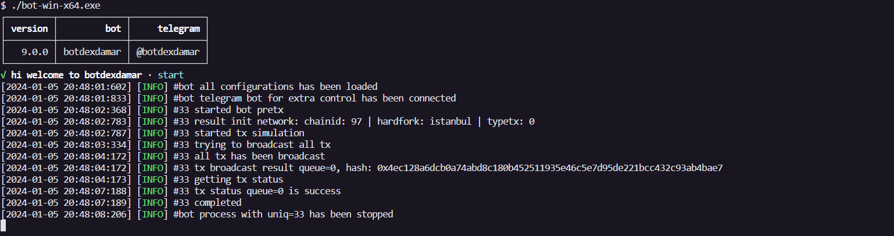

<h1 align="center">
    BOTDEXDAMAR
</h1>

  
  
  
  
  

 

 

### 📌 Introduction
Botdexdamar is an automated tool designed to trade and transact on decentralized blockchains. This bot has been established since 2019. The bot is equipped with various features that allow it to operate smoothly on decentralized exchanges. It can monitor market conditions and execute trades based on predefined parameters. Its automated nature allows it to run 24/7 without the need for constant human supervision. Botdexdamar also connects directly to blockchain nodes through APIs to integrate with various decentralized protocols. This gives it access to various investment opportunities in DeFi. With botdexdamar, you can make transactions such as buying new token launches faster. This bot can run on platforms like Uniswap, Pancakeswap, and others. Additionally, it supports different blockchains such as evm, solana.

### 📡 Support Blockchain
- evm (ethereum, bsc, arbitrum, ...etc) mainnet / testnet
- solana mainnet / testnet

### ❓ Question
- Is there a monthly fee? No, you only need to pay once.
- Does it require a dedicated personal node? Not all bots require it.
- Is there a repair fee? There are no repair fees.
- What blockchains does this bot support? ethereum (evm), solana.
- Does it support uniswap v3 or routers with that code? Yes.
- Does this bot support remote control? Yes, this bot supports additional remote control using telegrambot, you can set it in the bot.ini file.
- Does it support all dex on the ethereum network? yes if the dex router code uses uniswapV2 or uniswapV3 scheme.
- Is this bot illegal? This bot is only for technical purposes so if you do other things, it is your responsibility.
- Is this paid? yes.
- Is there a trial? You may with certain conditions, contact us.
- Is this bot safe from theft of funds? Yes, this bot is very safe because this bot runs on the client side or all processes run on your computer, if you are very skilled in computer engineering you can monitor network traffic for evidence.

### 💻 Step to install
- Download at [here](https://github.com/damartripamungkas/botdexdamar/releases)
- Extract zip
- Set the configuration in the config.ini file with the configFormat.ini file reference
- Run the bot file, if in windows you can double click or through the terminal
- Select the start menu
- Finish

### 📥 Test bot
you can get started right away using pretx bot for free

### 🌐 Website
under construction

### 📖 Documentation
https://docs.botdexdamar.xyz

### 📲 ContactUs
[telegram](https://t.me/damartripamungkas)

### 🔔 Community
https://t.me/botdexdamar

### 📝 License
Licensed see [here](./LICENSE)
